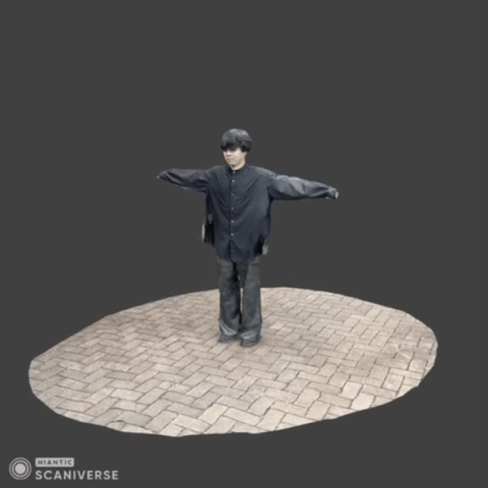
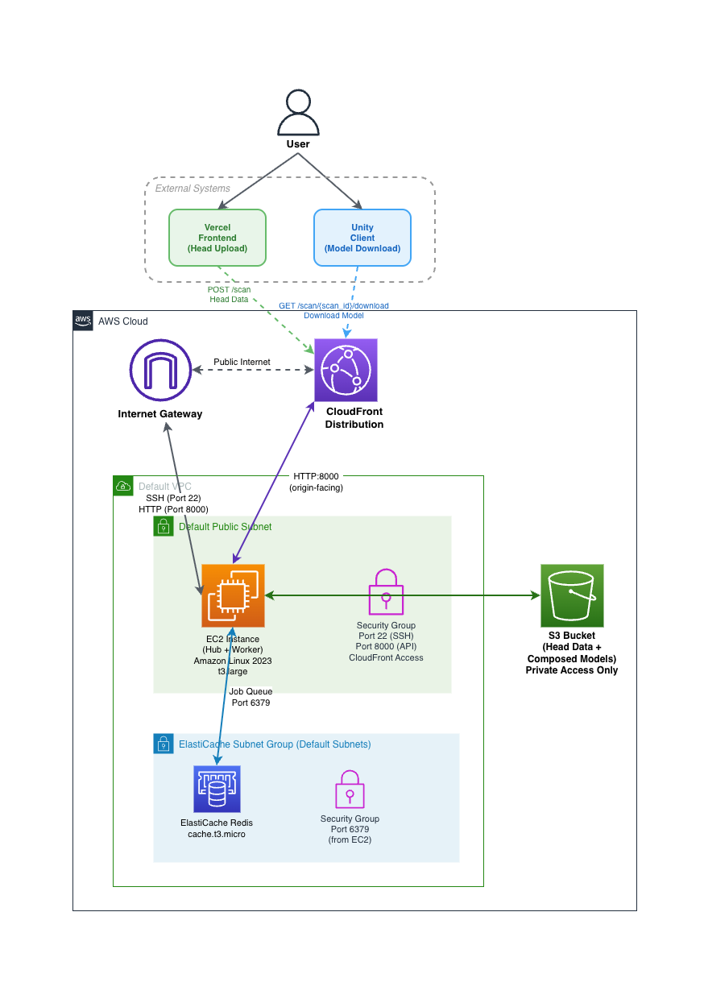

# pipeline

3Dヘッドスキャン（`.glb/.gltf`）をアップロードすると、キュー（Redis）経由でWorkerがBlenderをヘッドレス実行し、テンプレートアバターへ合成して成果物（`.glb`）をS3へ保存するパイプラインです。

後続の処理でUnityのオリンピックゲームに成果物を提供しユーザの顔でゲームを遊ぶことができる。

## 使用技術

- Backend/API: Python 3.12, FastAPI, Uvicorn, Redis, boto3（S3）
- Worker: Python 3.12, Blender 4.1.1（headless）, Redis, boto3（S3）
- Frontend: Vite, React, TypeScript, Three.js, `@react-three/fiber`
- Storage/Queue:
  - ローカル: MinIO（S3互換）, Redis
  - クラウド: Amazon S3, Amazon ElastiCache for Redis
- Infra/Deploy: Terraform, AWS（EC2 など）, Docker / Docker Compose

## Scaniverse

3Dヘッドスキャンの取得に、iOSアプリ [Scaniverse](https://scaniverse.com/)を使用しています。3Dモデルの構築、ヘッドモデルの切り取りをこのアプリを使用して行っています。


成果物



## 構成

- `hub/`：API（FastAPI）
  - スキャンデータ受け取り → S3へ保存 → Redisキュー投入
  - ステータス照会／成果物ダウンロード用エンドポイントを提供
- `worker/`：処理ワーカー（Python + Blender）
  - Redisキューからジョブ取得 → S3から入力を取得 → Blenderで変換 → S3へ出力
- `web/`：フロントエンド（Vite + React + Three.js）
  - `.glb/.gltf` のアップロードUI（ローカルではVite proxyで `hub` に接続）
- `infra/`：クラウド用Terraform（S3 + ElastiCache + EC2 など）
  - 詳細は `infra/README.md` を参照



## できること

- `.glb/.gltf` のアップロード（`POST /scan`）
- ステータス確認（`GET /scan/{scan_id}/status`）
- 一覧取得（`GET /scans`）
- 生成物の取得（`GET /scan/{scan_id}/download` / `GET /scan/{scan_id}/asset`）

## ローカル起動（Docker Compose）

依存（Redis + MinIO）を含めてローカルで完結します。

### 前提

- Docker（Compose v2）
- （任意）`jq`（例の `curl` をそのまま使う場合）

```bash
docker compose up --build
```

- Web: `http://localhost:3000`
- Hub API: `http://localhost:8000`
- MinIO Console: `http://localhost:9001`（user/pass: `minio` / `minio123456`）

### 動作確認（curl）

```bash
# 1) upload（scan_id を取得）
SCAN_ID=$(curl -sS -F "head=@./path/to/head.glb" http://localhost:8000/scan | jq -r .scan_id)
echo "$SCAN_ID"

# 2) status（queued → processing → done を待つ）
curl -sS "http://localhost:8000/scan/${SCAN_ID}/status" | jq

# 3) download（done になったら）
curl -L -o avatar.glb "http://localhost:8000/scan/${SCAN_ID}/download"
```

## クラウド起動（AWS）

- `infra/` のTerraformで、S3バケット／ElastiCache Redis／EC2（Docker）などを作成します
- EC2上では `docker-compose.cloud.yml` を使い、`hub` と `worker` のみを起動します（S3/Redisはマネージド）

手順は `infra/README.md` と `infra/terraform.tfvars.example` を参照してください。

## 環境変数

### hub / worker 共通

- `REDIS_URL`（例: `redis://redis:6379/0` / `redis://...:6379/0`）
- `S3_BUCKET`（例: `hack`）
- `S3_ENDPOINT`（MinIO等を使う場合のみ。例: `http://minio:9000`）
- `S3_ACCESS_KEY` / `S3_SECRET_KEY`（MinIO等を使う場合のみ）
- `AWS_REGION`（AWS S3を使う場合のみ。`S3_ENDPOINT` 未指定時に必須）

### worker のみ


- `BLENDER_BIN`（default: `/opt/blender/blender`）
- `TEMPLATE_FBX`（default: `/app/blender/template.fbx`）
- `HEAD_BONE`（default: `mixamorig7:Head`）
